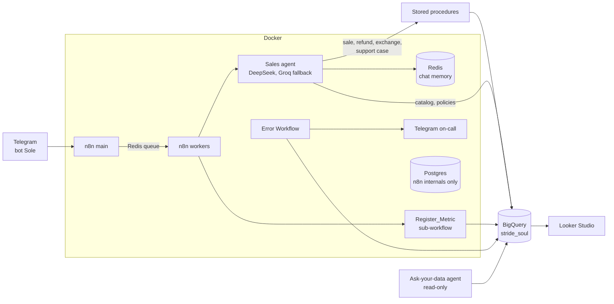

# Stride & Soul · Sole, an AI sales agent on n8n + BigQuery

**Sole** is the Telegram sales assistant of **Stride & Soul**, a footwear
store for urban subcultures (punk, goth, emo, hardcore, metal, straight
edge). Sole answers catalog and policy questions, registers sales with a
receipt, processes refunds and exchanges, and escalates to a person when
it should. Every step of every conversation is recorded as a process
event in **BigQuery**, so the funnel, its bottlenecks and the health of
each workflow show up in **Looker Studio** and can be queried in plain
English.

> Status: **phase 3 of 8, infrastructure.** BigQuery engine and Docker
> stack are written; the stack has been booted and verified. Workflows
> are built next. See [Roadmap](#roadmap).

## Architecture



**Why the business rules live in BigQuery stored procedures.** BigQuery
has no sequences, triggers, CHECK constraints or row locks. Each operation
(sale, refund, exchange, support case) is one transaction inside a
procedure. When two operations touch the same table at once, BigQuery
aborts one and n8n retries it, which is what prevents selling the last
pair twice or issuing the same receipt number twice. A `counters` table
replaces Postgres sequences.

## Repository

| Path | What |
|---|---|
| `bigquery/` | Dataset, tables, seed data, stored procedures, views and isolated tests, run in order `01`–`05` |
| `docker-compose.yml` | n8n in queue mode (main + workers), Redis, Postgres for n8n itself |
| `n8n/init/` | Boot scripts: credentials from `.env` + `secrets/`, workflow import, owner account, publishing |
| `n8n/workflows/` | Workflow JSON, the source of truth (imported on every start) |
| `secrets/` | Service-account keys, git-ignored |
| `docs/SETUP.md` | Step-by-step setup on Windows |

## Quick start

```powershell
copy .env.example .env      # fill it in, see docs/SETUP.md
docker compose up -d
```

Open http://localhost:5678. Full guide: [docs/SETUP.md](docs/SETUP.md).

## Data model

| Table | Purpose |
|---|---|
| `catalog` | 40 product variants with stock |
| `shipping_policy`, `return_policy` | Ready-to-send answers by topic |
| `sales` | Sales (+), refunds as credit notes (−), exchanges linked to the original receipt |
| `returns` | Returned pairs (never back to sellable stock) |
| `support_cases` | Escalations; contact is mandatory |
| `conversation_events` | Stage-by-stage funnel: start → catalog → data validated → sale / support |
| `audit_logs` | One row per turn, personal data masked |
| `execution_metrics` | One row per workflow execution: status, duration, failing node |

Views: `v_catalog_available`, `v_sales_daily`, `v_stage_durations`,
`v_stage_bottlenecks`, `v_funnel_daily`, `v_funnel_conversion`,
`v_execution_kpis`, `v_support_queue`.

## Roadmap

| Phase | Deliverable | Status |
|---|---|---|
| 1. Discovery | Scope, accounts, brand | ✅ |
| 2. Orchestration | Architecture map | ✅ |
| 3. Infrastructure | BigQuery engine + tests, Docker stack | 🟡 written; BigQuery tests pending a GCP project |
| 4. Build | Workflows: intake, agent, transaction tools, logger, metrics, error handler, analyst agent | ☐ |
| 5. Testing | Test table with execution ids, incl. concurrent last-pair sale | ☐ |
| 6. Dashboard | Looker Studio on BigQuery views | ☐ |
| 7. Documentation | Reference doc per workflow, SOP, screenshots | ☐ |
| 8. Delivery | Demo script for interviews | ☐ |

## Privacy

Telegram user ids are salted and hashed before they reach BigQuery.
Audit logs mask e-mails and phone numbers. Full contact data is stored only
where it is operationally needed (receipts and support cases).
