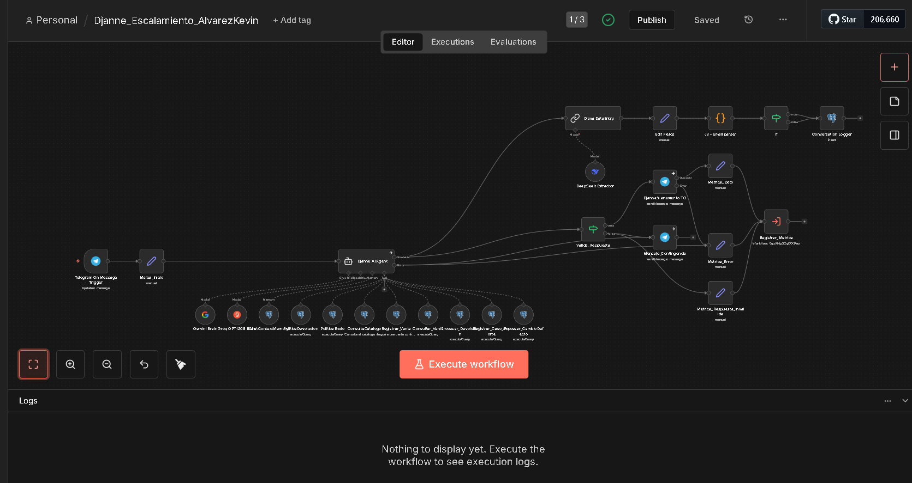
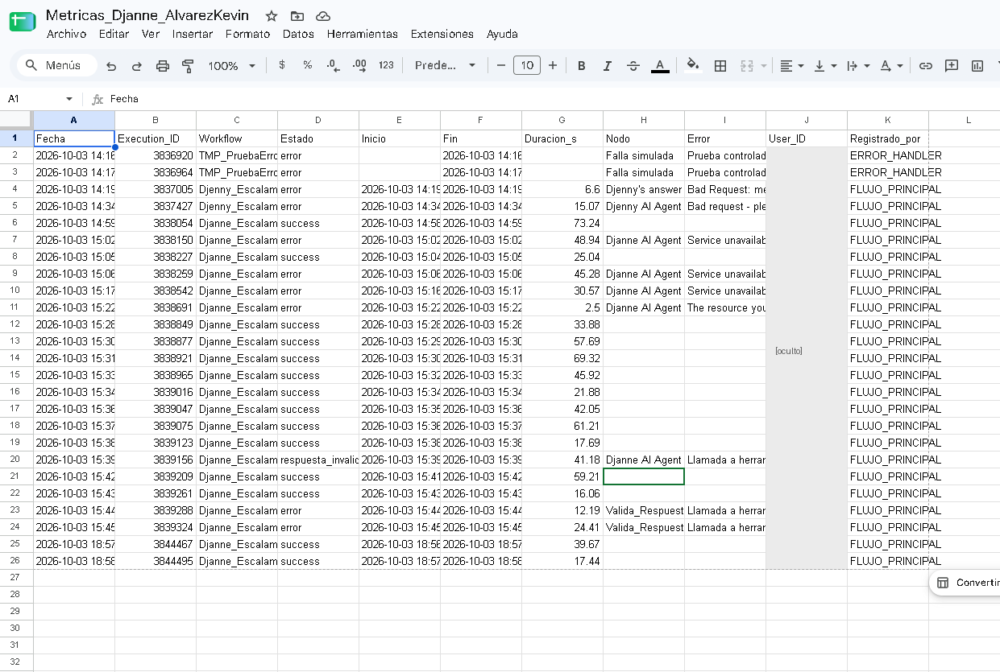
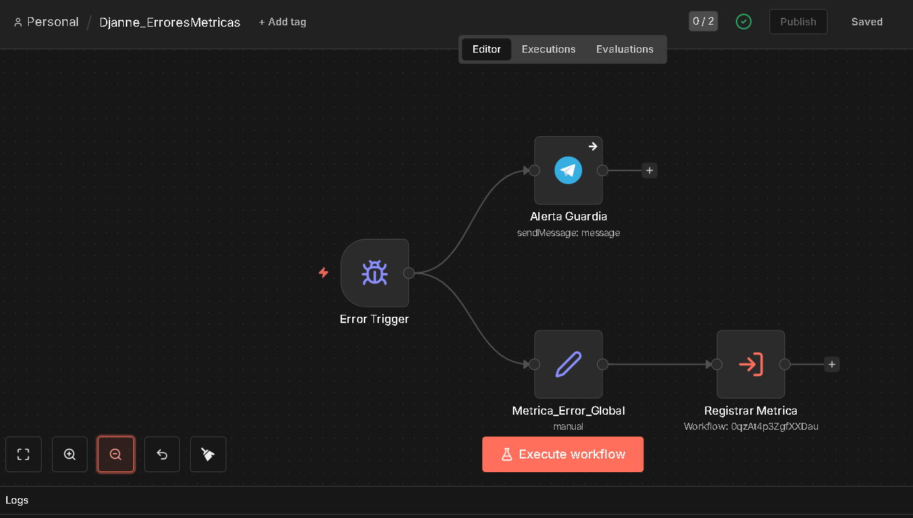

# n8n Portfolio — Kevin Alvarez

Automatizaciones y agentes de IA construidos con [n8n](https://n8n.io) durante el bootcamp de Kodigo (2026).
Incluye agentes conversacionales con memoria y herramientas transaccionales sobre Postgres, clasificación de correos con LLMs, manejo centralizado de errores y registro de métricas de ejecución.



## Proyectos

| # | Proyecto | Qué hace | Stack |
|---|----------|----------|-------|
| 01 | [Agente Djanne — escalamiento y métricas](workflows/01-agente-djanne-escalamiento) | Asistente de ventas por Telegram para una zapatería: catálogo, ventas, devoluciones, cambios por defecto y escalamiento a supervisor. Mide cada ejecución y responde con un mensaje de contingencia si el LLM falla. | AI Agent, Gemini + Groq (fallback), DeepSeek, Postgres, Telegram, Google Sheets |
| 02 | [Agente Djenny — memoria conversacional](workflows/02-agente-djenny-memoria) | Versión base del agente, con memoria por usuario persistente en Postgres y un segundo LLM que extrae y valida datos del cliente en paralelo. | AI Agent, Postgres Chat Memory, Gemini, Groq, Telegram |
| 03 | [Clasificador de correos con IA](workflows/03-clasificador-correos-ia) | Clasifica el inbox de Gmail en 5 categorías, etiqueta y archiva. Incluye la versión línea base y la optimizada, para comparar métricas. | Text Classifier, Groq, Gemini (respaldo), Gmail, Google Sheets |
| 04 | [Registro de contacto (Lovable)](workflows/04-registro-contacto-lovable) | Recibe aplicaciones desde un formulario web, bloquea duplicados (mismo correo + área en 91 días), registra y envía confirmación. | Webhook, Code (JS), Google Sheets, Gmail |
| 05 | [Alertas y notificaciones](workflows/05-alertas-y-notificaciones) | Error Workflow global que avisa por Telegram y registra el fallo para QA, más un aviso de correos importantes a Telegram. | Error Trigger, Telegram, Data Table, Gmail |
| 06 | [Fundamentos](workflows/06-fundamentos) | Primeros ejercicios: chatbot de consulta de clientes y webhook de registro. | Chat Trigger, Webhook, Google Sheets |

### 01 · Agente Djanne (Calzados Djohn)

Asistente virtual de una zapatería salvadoreña de calzado para subculturas urbanas. Atiende por Telegram, en español salvadoreño y con tono adaptable al cliente.

- **Cerebro:** AI Agent con Gemini como modelo principal y Groq `gpt-oss-120b` como fallback automático. Se probó en vivo: cuando Gemini devolvió 503, Groq respondió.
- **Memoria:** Postgres Chat Memory con el `user_id` de Telegram como session key, así cada cliente tiene su propio hilo.
- **Herramientas de lectura:** catálogo (solo modelos con stock > 0), política de envío y política de devolución.
- **Herramientas transaccionales:** registrar venta (IVA 13 % extraído del total y ticket FCF generado por la base), consultar venta, devolución con nota de crédito, cambio por defecto de fábrica y escalamiento de casos a supervisor. Un trigger en la base descuenta el stock y bloquea la sobreventa.
- **Log en paralelo:** un segundo LLM (DeepSeek) extrae nombre, correo y resumen de la conversación. Un Code node valida el correo con regex y lo enmascara antes de guardarlo.
- **Robustez:**
  - Valida la respuesta del agente y envía un mensaje de contingencia si viene vacía o con texto de tool-calling.
  - Registra métricas de éxito, error y respuesta inválida en un sub-workflow que escribe en Google Sheets.
  - Usa un Error Workflow dedicado que alerta por Telegram.

| Hoja de métricas | Error Workflow |
|---|---|
|  |  |

### 03 · Clasificador de correos: línea base vs. optimizado

| | Línea base | Optimizado |
|---|---|---|
| Disparador | Gmail Trigger (sondeo cada minuto) | Programado a las 7:50 a. m. (lote del inbox) |
| Categorías | 4 | 5 (se agrega PROVEEDORES, por dominio del remitente) |
| Modelo | Groq | Groq, con Gemini como respaldo vía salida de error |
| Etiquetado | 4 nodos Gmail | 1 nodo con `$prevNode.outputIndex` |
| Límites de cuota | — | Cuerpo recortado a 2 000 caracteres y lotes de 3 con pausa de 25 s |
| Métricas | Una fila por ejecución | Una fila por correo, con categoría y ruta (Groq o Gemini) |

Ambas versiones usan el mismo Error Workflow (`Workflow_ErroresMetricas_ClasificaCorreos`), que registra cada fallo en la misma hoja de métricas.

## Cómo correrlos en tu propio n8n

```bash
cp .env.example .env        # completa contraseñas y N8N_ENCRYPTION_KEY
docker compose up -d
# abre http://localhost:5678
```

Después importa cada `.json` con **Workflows → Import from File**, o en bloque:

```bash
docker compose exec n8n n8n import:workflow --separate --input=/workflows/01-agente-djanne-escalamiento
```

Los workflows están **sanitizados**: no traen credenciales, IDs de hojas ni datos personales. Para dejarlos funcionando sigue la guía [docs/MIGRACION.md](docs/MIGRACION.md).

## Estructura

```
workflows/            Workflows exportados y sanitizados, agrupados por proyecto
docs/                 Guía de migración y capturas
scripts/              sanitize_workflow.py: limpia exportaciones antes de publicarlas
docker-compose.yml    n8n + Postgres listo para levantar
```
