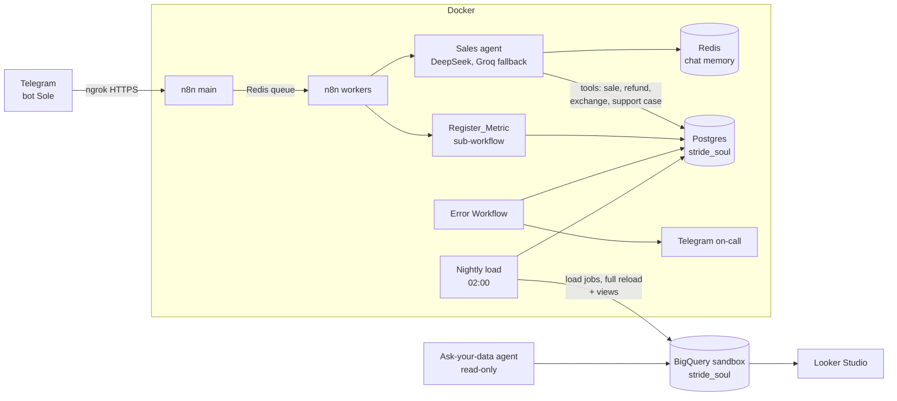

# Stride & Soul · Sole, an AI sales agent on n8n, Postgres and BigQuery

**Sole** is the Telegram sales assistant of **Stride & Soul**, a footwear
store for urban subcultures (punk, goth, emo, hardcore, metal, straight
edge). Sole answers catalog and policy questions, registers sales with a
receipt, processes refunds and exchanges, and escalates to a person when
it should. Every step of every conversation is recorded as a process
event; a nightly pipeline copies the data to **BigQuery**, where the
funnel, its bottlenecks and the health of each workflow show up in
**Looker Studio** and can be queried in plain English.

The whole stack runs on a laptop with Docker and costs nothing.

> Status: **phase 3 of 8, infrastructure.** Store database and Docker stack
> are tested (13 functional + 2 concurrency tests pass). Workflows are
> built next. See [Roadmap](#roadmap).

## Architecture



| Layer | Where | Why |
|---|---|---|
| Operations: sales, stock, receipts, support cases | **Postgres** | Real transactions: a trigger with a row lock prevents selling the last pair twice, a sequence issues receipt numbers, CHECK constraints keep amounts coherent |
| Events, metrics, audit log | Postgres | One source of truth, written by every workflow |
| Analytics | **BigQuery** (free sandbox) | Rebuilt every night from Postgres. The sandbox deletes tables after 60 days and blocks INSERT/UPDATE; a full reload makes both irrelevant |
| Dashboard | Looker Studio on BigQuery views | Free |

## Repository

| Path | What |
|---|---|
| `postgres/sql/` | Store schema, seed data (40 products, policies) and transactional functions |
| `postgres/tests/` | 13 functional tests + 2 concurrency tests on a throwaway database |
| `bigquery/` | Analytics dataset and views |
| `docker-compose.yml` | n8n in queue mode (main + workers), Redis, Postgres, ngrok |
| `n8n/init/` | Boot scripts: credentials from `.env` + `secrets/`, workflow import, owner account, publishing |
| `n8n/workflows/` | Workflow JSON, the source of truth (imported on every start) |
| `secrets/` | Service-account key, git-ignored |
| `docs/SETUP.md` | Step-by-step setup on Windows |

## Quick start

```powershell
copy .env.example .env      # fill it in, see docs/SETUP.md
docker compose up -d
docker compose exec postgres sh /tests/run.sh
```

Open http://localhost:5678. Full guide: [docs/SETUP.md](docs/SETUP.md).

## Store database

| Table | Purpose |
|---|---|
| `catalog` | 40 product variants with stock |
| `shipping_policy`, `return_policy` | Ready-to-send answers by topic |
| `sales` | Sales (+), refunds as credit notes (−), exchanges linked to the original receipt |
| `returns` | Returned pairs (never back to sellable stock) |
| `support_cases` | Escalations; contact is mandatory |
| `conversation_events` | Stage-by-stage funnel: start → catalog → data validated → sale / support |
| `audit_logs` | One row per turn, e-mails and phones masked |
| `execution_metrics` | One row per workflow execution: status, duration, failing node |

Functions the agent's tools call: `register_sale`, `process_refund`,
`process_exchange`, `open_support_case`. Errors start with a code
(`VALIDATION`, `NOT_FOUND`, `OUT_OF_STOCK`, `ALREADY_PROCESSED`) so the
agent can explain them.

BigQuery views: `v_stock_position`, `v_sales_daily`, `v_stage_durations`,
`v_stage_bottlenecks`, `v_funnel_daily`, `v_funnel_conversion`,
`v_execution_kpis`, `v_support_queue`.

## Roadmap

| Phase | Deliverable | Status |
|---|---|---|
| 1. Discovery | Scope, accounts, brand | ✅ |
| 2. Orchestration | Architecture map | ✅ |
| 3. Infrastructure | Store database + tests, Docker stack, BigQuery dataset | 🟡 database and stack tested; BigQuery dataset pending |
| 4. Build | Workflows: intake, agent, transaction tools, logger, metrics, error handler, nightly load, analyst agent | ☐ |
| 5. Testing | Test table with execution ids | ☐ |
| 6. Dashboard | Looker Studio on BigQuery views | ☐ |
| 7. Documentation | Reference doc per workflow, SOP, screenshots | ☐ |
| 8. Delivery | Demo script for interviews | ☐ |

## Privacy

Telegram user ids are salted and hashed before they are stored. Audit logs
mask e-mails and phone numbers. Full contact data is stored only where it
is operationally needed (receipts and support cases) and never leaves
Postgres: the BigQuery copy has no names, contacts or conversation text.
