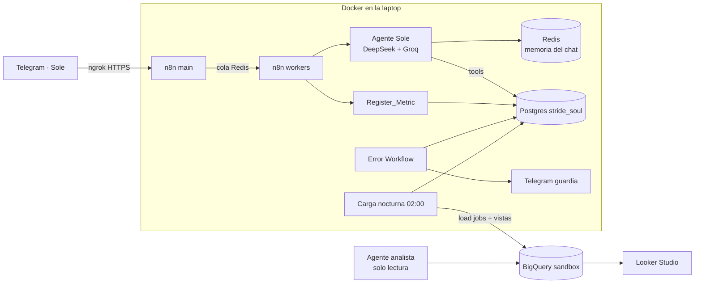

# Handoff: estado del proyecto Stride & Soul (para retomar en otra PC)

> Documento interno de trabajo para Kevin y para la próxima sesión de Claude.
> Está en español a propósito: el resto del repo está en inglés.
> Última actualización: 2026-10-10, fase 3 completa: infraestructura y carga a BigQuery probadas en la laptop. Siguiente: fase 4.

---

## 1. Contexto en una página

- **Objetivo:** portafolio para el puesto **Data and Automation Systems Builder** en
  THE/STUDIO (remoto, contratista). El puesto pide SQL, un data warehouse en la nube
  (por ejemplo BigQuery), BI (Looker Studio), n8n o Make, alertas en tiempo real,
  eventos de proceso etapa por etapa y una interfaz de consultas en lenguaje natural.
- **Proyecto:** **Sole**, agente de ventas por Telegram de **Stride & Soul**, tienda de
  calzado para subculturas urbanas (punk, goth, emo, hardcore, metal, straight edge).
  Es la evolución de Djenny/Djanne (Calzados Djohn), reconstruida limpia.
- **Forma de trabajo:** el *Playbook de proyectos n8n de Kevin Alvarez*:
  - Orquestación primero: no se escribe código sin el mapa acordado.
  - Preguntar antes de asumir.
  - Artefactos completos, nunca fragmentos.
  - Un paso a la vez, guiado por capturas.
  - Infraestructura probada antes de gastar cuota de IA.
  - Comunicación en español; el repo, en inglés.
- **Repo:** `kev0alv/n8n-portfolio`, rama `claude/vibrant-planck-2cz97w`,
  PR https://github.com/kev0alv/n8n-portfolio/pull/2
- **Costo:** USD 0. Todo corre en la laptop con Docker más servicios gratuitos.

## 2. Decisiones tomadas (no volver a discutir salvo que Kevin lo pida)

| # | Decisión |
|---|---|
| Cuentas | Todo bajo **kev.alvareze@gmail.com**. Nada de la cuenta educativa (Kodigo). |
| LLM principal | **DeepSeek** (Kevin tiene créditos) |
| LLM de respaldo | **Groq** con cuenta personal nueva (`openai/gpt-oss-120b`) |
| Marca | Tienda **Stride & Soul**, agente **Sole** (rima con *soul* y con *suela*) |
| Idioma | Repo, workflows y bot en **inglés**. Conversación con Kevin en español. |
| Máquina | Windows, HP ProBook 450 G8, i7, 32 GB RAM. Docker Desktop con WSL2. |
| Región de datos | **US** |
| Bot de Telegram | **Nuevo** (Sole), creado con @BotFather |
| Túnel para Telegram | **ngrok** con dominio estático gratuito |
| Workflows anteriores | No se migran: agente nuevo |
| Presupuesto | **USD 0.** Kevin no puede pagar el prepago de USD 30 de Google Cloud. Por eso BigQuery corre en **sandbox**. |
| Arquitectura (revisada y aprobada) | **Postgres** = operación (ventas, stock, tickets, casos, eventos, métricas). **BigQuery sandbox** = copia analítica recargada cada noche por n8n. **Looker Studio** sobre BigQuery. |

**Por qué híbrido y no todo en BigQuery:** el sandbox no permite INSERT ni UPDATE y
borra las tablas a los 60 días. La recarga completa nocturna (load jobs con
`WRITE_TRUNCATE` + recrear vistas) hace irrelevantes ambos límites. Cuando Kevin
active facturación, solo cambia la frecuencia de la carga.

## 3. Arquitectura



## 4. Estado por fase

| Fase | Estado |
|---|---|
| 1. Descubrimiento | ✅ |
| 2. Orquestación (mapa) | ✅ aprobado (versión revisada a USD 0) |
| 3. Infraestructura | 🟡 en curso. Detalle abajo. |
| 4. Construcción de workflows | ☐ |
| 5. Pruebas con IDs de ejecución | ☐ |
| 6. Dashboard Looker Studio | ☐ |
| 7. Documentación (MD por workflow, SOP) | ☐ |
| 8. Entrega (guion de demo para entrevistas) | ☐ |

### Fase 3, detalle

| Pieza | Estado | Evidencia |
|---|---|---|
| Base Postgres `stride_soul` (esquema, seed, funciones) | ✅ probada | 13/13 pruebas funcionales y 2/2 de concurrencia, corridas por Claude en un contenedor en la nube |
| Stack Docker (n8n queue mode, worker, Redis, Postgres, ngrok) | ✅ probado | Arranque limpio, importación de credenciales, creación del owner, publicación de workflows, worker ejecutando desde la cola |
| BigQuery `bigquery/01` y `02` | ✅ ejecutado | 2026-10-10 en BigQuery Studio: `01` SUCCESS (7 declaraciones: dataset + 6 tablas), `02` SUCCESS (8 vistas) |
| Proyecto GCP `stride-soul`, sandbox, sin facturación | ✅ | Captura con la etiqueta "Zona de pruebas" |
| Cuenta de servicio `n8n-bigquery` con BigQuery Data Editor y Job User | ✅ | Captura de IAM |
| Llave JSON | ✅ en `C:\Users\skaci\stride-soul-secrets\bq-service-account.json` | Captura del explorador |

## 5. Lo que hay en el repo

| Ruta | Contenido |
|---|---|
| `postgres/init/00-init.sh` | Primer arranque: crea el rol `sole_app` y la base `stride_soul`, y carga los SQL |
| `postgres/sql/01_schema.sql` | Tablas con CHECK, secuencia de tickets `SS-000001`, trigger de stock con bloqueo de fila |
| `postgres/sql/02_seed.sql` | 40 productos, 6 políticas de envío, 8 de devolución, settings (IVA 13 %, envío USD 2, gratis desde 2 pares) |
| `postgres/sql/03_functions.sql` | `register_sale`, `process_refund`, `process_exchange`, `open_support_case`. Errores con código: `VALIDATION`, `NOT_FOUND`, `OUT_OF_STOCK`, `ALREADY_PROCESSED`. |
| `postgres/tests/` | `run.sh` + `tests.sql`: base desechable, 13 pruebas funcionales y 2 de concurrencia |
| `bigquery/01_dataset_and_tables.sql` | Dataset `stride_soul` (US) y tablas destino de la carga nocturna. Sin nombres, contactos ni texto de conversaciones. |
| `bigquery/02_views.sql` | Vistas: stock, ventas diarias, duración por etapa, cuellos de botella, embudo, conversión, KPIs de ejecución, cola de soporte |
| `docker-compose.yml` | n8n 2.42.4 main + worker, Redis, Postgres 17, ngrok (perfil `tunnel`), pasos de importación y setup |
| `n8n/init/` | `build-credentials.js` (credenciales desde `.env` + `secrets/`), `import.sh`, `setup.sh` (owner + publicar workflows) |
| `n8n/workflows/` | Vacío: aquí van los JSON de la fase 4 |
| `docs/SETUP.md` | Guía de instalación en Windows, en inglés |
| `.env.example` | Todas las variables, con instrucciones |

## 6. Pasos pendientes de Kevin, en orden

### 6.1 Terminar el paso 5: dataset en BigQuery ✅ (2026-10-10)

1. Copiar el contenido de
   https://github.com/kev0alv/n8n-portfolio/blob/claude/vibrant-planck-2cz97w/bigquery/01_dataset_and_tables.sql
   (botón **Copy raw file**).
2. https://console.cloud.google.com/bigquery?project=stride-soul → **+** (pestaña nueva)
   → pegar → **Ejecutar**.
3. Repetir con `bigquery/02_views.sql`.
4. Resultado esperado: dataset `stride_soul` con **6 tablas** y **8 vistas**.
5. Si hay error: captura del mensaje para Claude. Este SQL nunca se ha ejecutado contra BigQuery.

### 6.2 Preparar la PC (si no está hecho)

1. PowerShell como administrador: `wsl --install`, luego reiniciar.
2. Docker Desktop (con WSL2) y Git for Windows.
3. Crear `C:\Users\skaci\.wslconfig` con este contenido y luego ejecutar `wsl --shutdown`:
   ```ini
   [wsl2]
   memory=8GB
   ```

### 6.3 Clonar y configurar

```powershell
cd C:\Users\skaci
git clone https://github.com/kev0alv/n8n-portfolio.git
cd n8n-portfolio
git checkout claude/vibrant-planck-2cz97w
copy C:\Users\skaci\stride-soul-secrets\bq-service-account.json secrets\
copy .env.example .env
notepad .env
```

En `.env`:
- `GCP_PROJECT_ID=stride-soul`
- Contraseñas, `N8N_ENCRYPTION_KEY` y `USER_HASH_SALT` aleatorios. Generarlos en PowerShell:
  ```powershell
  -join ((48..57)+(97..102) | Get-Random -Count 64 | % {[char]$_})
  ```

### 6.4 Cuentas que faltan

| Qué | Dónde | Variable en `.env` |
|---|---|---|
| API key de DeepSeek, nueva y solo para este proyecto | platform.deepseek.com | `DEEPSEEK_API_KEY` |
| API key de Groq, cuenta personal | console.groq.com | `GROQ_API_KEY` |
| Bot **Sole** | Telegram → @BotFather → `/newbot` | `TELEGRAM_BOT_TOKEN` |
| Tu chat ID numérico | Telegram → @userinfobot | `TELEGRAM_ONCALL_CHAT_ID` |
| Cuenta ngrok + authtoken | ngrok.com | `NGROK_AUTHTOKEN` |
| Dominio estático gratuito de ngrok | ngrok.com → Domains | `NGROK_DOMAIN` (sin https) y `N8N_WEBHOOK_URL` (`https://…/`) |
| Activar el túnel | — | `COMPOSE_PROFILES=tunnel` |

### 6.5 Levantar y probar

```powershell
docker compose up -d
docker compose ps
docker compose exec postgres sh /tests/run.sh
docker compose logs n8n-import
```

- Esperado de las pruebas: `ALL 13 TESTS PASSED` más dos líneas `PASS` de concurrencia.
- Abrir http://localhost:5678 y entrar con `N8N_OWNER_EMAIL` / `N8N_OWNER_PASSWORD`.
- Opcional: licencia gratuita de n8n Community en Settings → Usage and plan.

## 7. Siguiente: fase 4, workflows a construir (mapa aprobado)

| # | Workflow | Detalle |
|---|---|---|
| 01 | Telegram Intake | Normalizar, descartar repetidos por `update_id`, límite por usuario, Marca_Inicio, hash del user_id con `USER_HASH_SALT` |
| 02 | Sales Agent (Sole) | DeepSeek principal con reintentos, Groq de respaldo, memoria en Redis (8–10 turnos), Postgres Tool solo lectura para catálogo y políticas, Valida_Salida, Mensaje_Contingencia |
| 03 | Transaction tools | Sub-workflows que llaman `register_sale`, `process_refund`, `process_exchange`, `open_support_case` |
| 04 | Event & Audit Logger | Rama paralela con On Error Continue: `conversation_events` y `audit_logs` con PII enmascarada |
| 05 | Register_Metric | Sub-workflow sin esperar; esquema §2.1 en `execution_metrics` |
| 06 | Error Workflow | Fila con `ERROR_HANDLER` más alerta por Telegram a guardia |
| 07 | Nightly BigQuery Load | 02:00: exportar tablas de Postgres → load jobs `WRITE_TRUNCATE` → re-ejecutar `02_views.sql` |
| 08 | Ask Your Data | Agente analista sobre BigQuery, solo SELECT |
| 09 | Daily KPI Digest | Premium; lo primero que se recorta |
| 99 | Failure Drill | Schedule + Stop and Error; se desactiva al terminar |

Pruebas previstas (fase 5): consulta de catálogo, correo inválido, venta, venta
simultánea del último par desde n8n, reembolso, cambio, escalamiento, marca fuera de
catálogo, tema fuera de alcance, caída de DeepSeek que pasa a Groq, ambos modelos
caídos que dan contingencia, simulacro de fallo, agente analista intentando escribir.

## 8. Riesgos y puntos sin verificar

| Riesgo | Plan |
|---|---|
| ~~El SQL de BigQuery nunca se ejecutó~~ | ✅ Validado el 2026-10-10 (paso 6.1) |
| ~~Carga nocturna en el sandbox: el nodo de BigQuery de n8n inserta por streaming, que el sandbox **no permite**~~ | ✅ Probado el 2026-10-10. HTTP Request `POST /upload/bigquery/v2/projects/{p}/jobs?uploadType=multipart` (cuerpo raw `multipart/related`: metadatos JSON + NDJSON, `WRITE_TRUNCATE`), credencial `googleApi` con `httpNode: true` y scope `bigquery`; luego GET del job. `catalog`: 40 filas, `state=DONE`; recargar no duplica. Evidencia: ejecución 1 (CLI, proceso main) y ejecución 2 (manual desde el editor, `Worker started execution 2`), job `job_4cet_Zlzz-3o5eqQDOdoZIzbEouf`, `badRecords=0`. Postgres arma el NDJSON con `string_agg(json_build_object(...))` y timestamps `YYYY-MM-DD HH24:MI:SS.US UTC`. |
| DeepSeek con tools: en n8n 2.3.5 el modo thinking fallaba con herramientas | Probar con n8n 2.42.4 y el nodo nativo `DeepSeek Chat Model`, con una sola llamada aislada. Si falla, usar el modelo sin thinking. |
| `$('Nodo')` en Code node se colgaba en Kodigo | Sin probar en Docker. Mientras tanto, Code nodes solo con `$json`. |
| Python no está disponible en Code node (el runner interno no trae Python) | Usar JavaScript |
| Cada `docker compose up` reimporta los workflows y eso los desactiva | `setup.sh` los vuelve a publicar según `ACTIVATE_WORKFLOWS` |

## 9. Restricciones encontradas (para la tabla §5 del Playbook)

| Restricción | Docker propio, n8n 2.42.4 | Workaround |
|---|---|---|
| Webhook de producción | ✅ funciona (con ngrok para Telegram) | — |
| Dirección de escucha | n8n y el worker intentan IPv6 y fallan en hosts sin IPv6 | `N8N_LISTEN_ADDRESS=0.0.0.0` y `N8N_WORKER_SERVER_ADDRESS=0.0.0.0` (ya en compose) |
| Versión de Postgres | n8n 2.42 exige 17 o superior | `postgres:17-alpine` |
| Owner | La importación no puede publicar workflows sin owner | `setup.sh` crea el owner por REST y luego publica |
| Cookie de sesión | Es `Secure`; curl no la manda por http a un host que no sea localhost | `setup.sh` la lee de `Set-Cookie` y la envía a mano |
| `WEBHOOK_URL` | Obsoleta | `N8N_WEBHOOK_URL` |
| Healthcheck de Postgres | `pg_isready` por socket responde antes de que terminen los scripts de inicio | Verificar por TCP (`-h 127.0.0.1`) |
| Healthcheck de n8n | En Docker Desktop (Windows), `localhost` dentro del contenedor resuelve a `::1` y n8n solo escucha en IPv4: queda *unhealthy* y el worker nunca arranca | `wget` a `http://127.0.0.1:5678/healthz/readiness` |
| BigQuery sandbox | Sin INSERT/UPDATE ni streaming; tablas expiran a los 60 días | Postgres opera; BigQuery se recarga completo cada noche |
| Credencial `googleApi` en HTTP Request | Por defecto (`httpNode: false`) el nodo HTTP Request no la puede usar | `build-credentials.js` la crea con `httpNode: true` y `scopes: https://www.googleapis.com/auth/bigquery` |
| `n8n execute` (CLI) | No soporta queue mode: corre en el proceso main | Solo para pruebas; las ejecuciones reales van por la cola |

## 10. Reglas de seguridad

- Llaves y tokens solo en `.env` y `secrets/`, que están en `.gitignore`. **Nunca** en el
  chat, en capturas ni en commits.
- La llave de la cuenta de servicio vive en `C:\Users\skaci\stride-soul-secrets\` y en
  `secrets\` del repo. No dejar copias en Descargas.
- No tocar **Actualizar / Upgrade** en BigQuery: es el camino de pago.
- Los user_id de Telegram se guardan con hash y sal. La copia en BigQuery no lleva
  nombres, contactos ni texto de conversaciones.

## 11. Cómo retomar con Claude en esta PC

1. En la app de Claude: **+ New** → entorno **Local** → elegir la carpeta
   `C:\Users\skaci\n8n-portfolio`, después de clonar (paso 6.3).
2. Primer mensaje sugerido:

   > Proyecto n8n Stride & Soul. Lee `docs/HANDOFF.md` y mi Playbook. Seguimos el
   > Playbook: orquestación primero, un paso a la vez, en español. Estamos en la fase 3,
   > paso 6.1 (dataset en BigQuery). Corre `docker compose exec postgres sh /tests/run.sh`
   > después de levantar el stack y muéstrame el resultado.

3. Adjuntar el Playbook (`n8n_Playbook_AlvarezKevin.md`) en esa sesión, porque no
   está en el repo.
